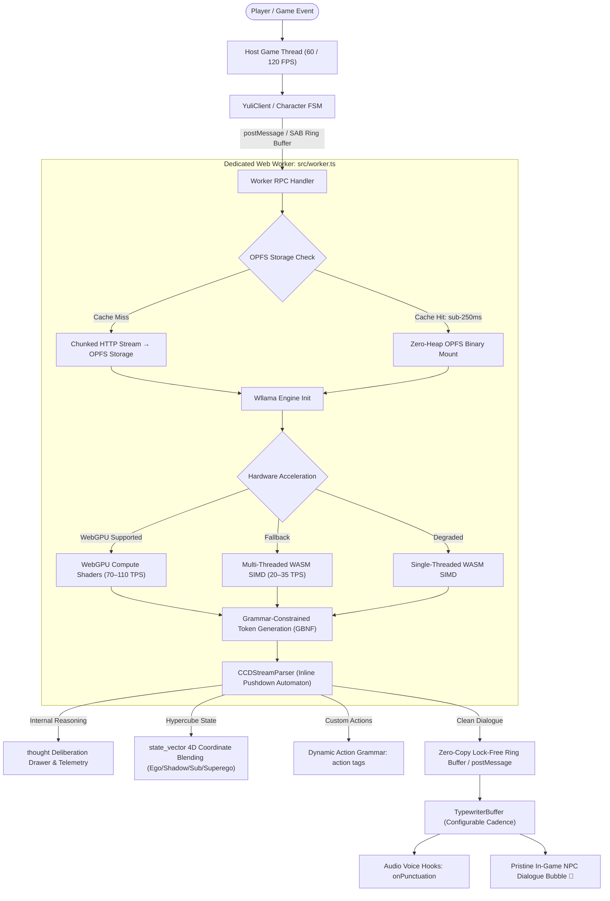

# @yuli-ai/web ⚡
### Embedded Edge Cognitive Persona Runtime & Character SDK for Web Games, PWAs & Mini Apps

[](https://www.typescriptlang.org/)
[](https://www.w3.org/TR/webgpu/)
[](https://webassembly.org/)
[](https://github.com/mgieta/wllama)
[](https://huggingface.co/economyofdreams/Yuli-Qwen2.5-0.5B-Reddit-v0.1.0)
[](https://developer.mozilla.org/en-US/docs/Web/API/File_System_API/Origin_private_file_system)
[](https://vitest.dev/)
[](./LICENSE)

---

## 📖 Overview

**`@yuli-ai/web`** is an ultra-low-latency, edge-optimized cognitive persona runtime and interactive character SDK engineered specifically for modern WebGL games (Three.js, Babylon.js, PixiJS, Unity WebGL), Progressive Web Apps (PWAs), and Telegram Mini Apps.

Traditional NPC dialogue and game persona systems depend heavily on remote LLM cloud APIs—incurring unpredictable recurring cloud bills, 500ms–2s+ network round trips, offline failure modes, and user privacy risks. **Yuli eliminates the cloud entirely** by executing quantized neural models (such as `Qwen2.5-0.5B-Instruct` in 4-bit GGUF, ~380MB) directly inside the user's browser at **70–110 TPS on WebGPU** and **20–35 TPS on multi-threaded WASM SIMD**.

Rather than dumping unconstrained text streams onto the screen, Yuli introduces a **bifurcated deliberation pipeline**:
- 🧠 **Cognitive Deliberation Firewall**: Internal reasoning (`<thought>...</thought>`) and 4-Sides-of-the-Mind psychological state updates (`<state_vector><s:XX></state_vector>`) are isolated inline by an atomic Pushdown Automaton parser and never bleed into dialogue text.
- 💬 **Human-Facing Game Dialogue**: Pristine, natural dialogue is streamed with dynamic typewriter cadence, audio punctuation sound blips (`.`, `!`, `?`), and zero frame-rate stutter on the host rendering loop.

---

## ⚡ The Edge Deliberation & Dialogue Pipeline



---

## 🏛️ Architectural Invariants & Engineering Laws

`@yuli-ai/web` is built upon strict architectural laws to guarantee deterministic game loop execution, zero memory leaks, and rock-solid edge stability:

### 1. Zero Main-Thread UI Contention (Isolated Worker Law)
* Neural network inference, tensor operations, weight deserialization, and Wasm memory allocations MUST NEVER run on the main browser thread.
* All model execution resides strictly within `src/worker.ts`.
* The host rendering thread (Three.js, Babylon.js, PixiJS, Canvas, or DOM) remains completely uninterrupted at 60/120 FPS during active 100+ TPS token streaming.

### 2. Persistent Zero-Heap Model Storage (The OPFS Invariant)
* Large model weights (~380MB GGUF binaries) MUST NOT be loaded or deserialized into transient JavaScript heap arrays (`ArrayBuffer`).
* Models are streamed directly via HTTP chunking into the browser's Origin Private File System (`FileSystemWritableFileStream`) via `OPFSStorageManager`.
* Subsequent page reloads mount directly from OPFS in under **250ms cold boot**, eliminating redundant downloads and heap thrashing.

### 3. Cognitive Deliberation Firewall (The Tag Firewall & PDA Law)
* Yuli outputs dialectical reasoning traces wrapped in `<thought>` tags and hypercube state updates in `<state_vector><s:XX></state_vector>`.
* Raw reasoning tokens MUST NEVER bleed into dialogue streams, character bubbles, or user-facing interfaces.
* The `CCDStreamParser` functions as an inline Pushdown Automaton (PDA) with partial tag boundary buffering, stripping orphan tags and isolating thought tokens into private deliberation callbacks (`onThought`) while emitting pure dialogue via `onToken`.

### 4. $F_2^4$ 4-Sides-of-the-Mind Hypercube Geometry
* Cognitive state anchors map strictly across 16 coordinates (`<s:00>` through `<s:0F>`) with Hamming distance 1 adjacency across 4 psychological quadrants:
  * **Ego** (`0EE` → `0x00`–`0x03`): Curiosity, excitement, open culinary exploration.
  * **Shadow** (`1E6` → `0x04`–`0x07`): Critical correction, skepticism, debt realism.
  * **Subconscious** (`2E7` → `0x08`–`0x0B`): Pragmatic execution, recipe ROI, structured systems.
  * **Superego** (`3E1` → `0x0C`–`0x0F`): Hard boundaries, austerity rules, discipline.
* Continuous coordinates $\mathbf{v} \in [-1, 1]^4$ enable real-time Exponential Moving Average (EMA) vector interpolation (`blendVectors`) and emotional trajectory tracking.

### 5. Hardware Fallback Cascade
* The engine guarantees graceful hardware negotiation across client environments without throwing fatal exceptions:
  1. **WebGPU Acceleration** (Compute Shaders; 70–110 TPS mobile/desktop)
  2. **Multi-Threaded WASM + 128-bit SIMD** (via `SharedArrayBuffer` when cross-origin isolated; 20–35 TPS)
  3. **Single-Threaded WASM SIMD** (graceful degraded mode for non-isolated environments)

### 6. Zero-Copy Token Ring Buffer (SharedArrayBuffer Atomics)
* When cross-origin isolation headers (`COOP`/`COEP`) are present, generation tokens flow over a lock-free circular ring buffer (`TokenRingBufferWriter` → `TokenRingBufferReader`).
* Eliminates JSON serialization and `postMessage` event loop tick latency during high-speed 100+ TPS bursts. Main thread consumes via non-blocking atomic polling. Gracefully falls back to structured messaging when unsupported.

### 7. Grammar-Constrained Logit Sampling (Native GBNF)
* Logit generation is strictly bounded at the sampler level via native llama.cpp GBNF grammars (`getYuliGrammar()`).
* Syntactic compliance for deliberation tags, state vectors, and custom game action schemas is guaranteed mathematically without relying on post-hoc regex fixups or retries. Non-terminals use hyphenated identifiers to ensure compatibility across llama.cpp revisions.

### 8. KV-Cache & Timeline Snapshot Engine (`YULI_SNAP_V1`)
* Compact binary serialization captures full conversation context, discrete state vectors, and continuous 4D coordinates.
* Facilitates sub-5ms narrative timeline branching, save/load states, and undo/redo capabilities for CYOA (Choose Your Own Adventure) games.

### 9. Export Order & Dual-Format Distribution Law
* `package.json` export maps strictly declare `"types"` **before** `"import"` and `"require"` conditions to prevent TypeScript declaration resolution failures:
  ```json
  ".": {
    "types": "./dist/index.d.ts",
    "import": "./dist/index.mjs",
    "require": "./dist/index.js"
  }
  ```
* Both ESM and CJS bundles are pre-compiled with zero `tsup` internal `dts: true` crashes on Node 24.

---

## ✨ Features & Capabilities

- 🧠 **100% Client-Side Inference**: Runs on-device with zero cloud server dependencies, zero recurring API invoices, and complete offline capability.
- 🛡️ **Inline Pushdown Automaton (`CCDStreamParser`)**: State-of-the-art token parser that strips internal deliberative thoughts and emits clean dialogue, state updates, and delta tokens.
- 🌐 **4D Hypercube Cognitive State Engine**: 16 psychological coordinates with Hamming distance 1 adjacency and continuous $[-1, 1]^4$ vector blending.
- 🎮 **Agnostic Character FSM (`YuliCharacterFSM`)**: 7-state character lifecycle (`IDLE`, `DELIBERATING`, `THINKING`, `VECTOR_UPDATE`, `STREAMING_DIALOGUE`, `IDLE_COOLDOWN`, `ERROR`) with game telemetry injection and automatic KV rollback on error.
- 🎯 **Dynamic Action Grammar Compiler (`compileActionGrammar`)**: Compile arbitrary TypeScript game actions directly into GBNF logit constraints at runtime.
- ⚡ **Typewriter Buffer & Voice Hooks (`TypewriterBuffer`)**: Decouples bursty inference generation from UI display rate with smooth configurable pacing and punctuation audio hooks (`.`, `!`, `?`, `,`) for retro character voice blips.
- 💾 **Origin Private File System Storage (`OPFSStorageManager`)**: Chunked streaming weight download with persistent zero-heap storage, `<250ms` cached cold starts, and cache inspection API (`isModelCached`, `clearCachedModel`).
- ⏱️ **Inference Telemetry & Debug Logging**: Comprehensive runtime instrumentation capturing TTFT (Time to First Token), latency, token count, generation TPS, and full unredacted buffer inspection with one-click clipboard copying.

---

## 🛠️ Tech Stack

| Layer | Technology | Purpose |
| :--- | :--- | :--- |
| **Language & Engine** | TypeScript 5+ & Node 22/24+ | Strict type safety, inferred schemas, and modern runtime APIs |
| **Machine Learning Backend** | `@wllama/wllama` v3.6+ | Hardware-accelerated WebGPU and WASM inference via llama.cpp |
| **Target Model** | Qwen2.5-0.5B-Instruct (GGUF `Q4_K_M`) | Sub-1GB lightweight edge cognitive model (~380MB weight binary) |
| **Model Distribution** | Hugging Face Hub | Zero-cost CDN hosting: `economyofdreams/Yuli-Qwen2.5-0.5B-Reddit-v0.1.0` |
| **Persistent Storage** | Web OPFS (`Origin Private File System`) | High-speed, zero-heap client-side model caching and snapshot storage |
| **Concurrency & IPC** | Dedicated Web Workers & `SharedArrayBuffer` | Zero main-thread UI lag with lock-free atomic circular ring buffers |
| **Grammar Constraining** | GBNF (GGML BNF Grammar) | 100% deterministic syntax compliance at the logit sampler level |
| **Build & Compilation** | `tsup` + `tsc --emitDeclarationOnly` | High-performance dual ESM/CJS bundling without Node 24 worker crashes |
| **Testing Suite** | `vitest` v5+ | Fast, multi-suite unit testing for PDA parsers, FSM, and vector algebra |

---

## 📁 Repository Structure

```text
├── src/
│   ├── client.ts              # Primary YuliClient API with thread RPC management
│   ├── worker.ts              # Dedicated Web Worker inference host & Wllama binding
│   ├── dialogue/
│   │   ├── pipeline.ts        # Integrated dialogue pipeline connecting parser & typewriter
│   │   └── typewriter.ts      # Smooth typewriter buffer with punctuation audio triggers
│   ├── fsm/
│   │   ├── action-grammar.ts  # Runtime GBNF grammar compiler for custom game actions
│   │   └── character-fsm.ts   # 7-state character lifecycle machine with game telemetry hooks
│   ├── grammar/
│   │   └── gbnf.ts            # Native GBNF grammar definitions (hyphenated non-terminals)
│   ├── parser/
│   │   └── ccd.ts             # CCDStreamParser inline pushdown automaton (deliberation firewall)
│   ├── ringbuffer/
│   │   └── ring-buffer.ts     # Zero-copy SharedArrayBuffer circular ring buffer with atomics
│   ├── snapshot/
│   │   └── state-snapshot.ts  # Compact binary state checkpoint serializer (YULI_SNAP_V1)
│   ├── storage/
│   │   └── opfs.ts            # OPFSStorageManager for chunked streaming & instant mounting
│   ├── vector/
│   │   └── hypercube.ts       # 4D hypercube coordinate mapping & continuous vector blending
│   └── index.ts               # Public SDK entrypoint and runtime license declarations
├── demo/                      # Standalone interactive showcase with live OPFS progress & debug log
├── memory-bank/               # Authoritative architecture, patterns, and state tracking
│   ├── activeContext.md       # Current version status and active work streams
│   ├── productContext.md      # Edge AI value proposition and game loop patterns
│   ├── progress.md            # Verified test suites and known browser constraints
│   ├── projectbrief.md        # Sub-1GB budget and performance targets
│   ├── systemPatterns.md      # Architectural laws and pushdown automaton specifications
│   └── techContext.md         # Runtime dependencies, export rules, and license terms
├── tests/                     # Unit test suites (vitest)
├── GEMINI.md                  # Lead Systems Architect operational mandate and laws
├── LICENSE                    # Business Source License 1.1 (BSL 1.1)
├── package.json               # Package manifest with types-first export conditions
├── tsconfig.json              # Strict TypeScript compiler options
└── tsup.config.ts             # Multi-target bundler configuration
```

---

## 🚀 Quick Start Guide

### 1. Installation

```bash
pnpm add @yuli-ai/web
```

### 2. Basic Initialization & Streaming

```typescript
import { YuliClient } from '@yuli-ai/web';

// Initialize the edge cognitive engine
const client = new YuliClient();

// Check if model binary is already cached in OPFS
const isCached = await YuliClient.isModelCached();
console.log(`Model cached in OPFS: ${isCached}`);

// Initialize runtime (downloads model if missing, or mounts from OPFS in <250ms)
await client.init({
  onProgress: (progress) => {
    console.log(`Loading model: ${Math.round(progress.percent)}% (${progress.loaded}/${progress.total} bytes)`);
  }
});

// Prompt the character with real-time streaming hooks
const response = await client.prompt({
  messages: [
    { role: 'system', content: 'You are Yuli, an intuitive and street-smart companion.' },
    { role: 'user', content: 'What do you think of this sketchy merchant across the street?' }
  ],
  onToken: (token) => {
    // Pure dialogue tokens only — internal thoughts are completely firewalled
    process.stdout.write(token);
  },
  onThought: (thoughtToken) => {
    // Internal reasoning tokens (route to debug drawer or internal thought bubble)
    console.debug(`[Thought] ${thoughtToken}`);
  },
  onState: (state) => {
    // Hypercube coordinate update (e.g., quadrant: 'Ego', coordinate: '0x01')
    console.log(`State shifted to quadrant: ${state.quadrant} (${state.coordinate})`);
  },
  onComplete: (stats) => {
    console.log(`Completed in ${stats.totalTimeMs}ms (${stats.tokensPerSecond.toFixed(1)} TPS)`);
  }
});
```

### 3. Character FSM & Dynamic Action Grammars

Constrain character actions at the logit level and connect real-time game telemetry:

```typescript
import { YuliCharacterFSM, compileActionGrammar } from '@yuli-ai/web';

// Define strongly typed game actions
type GameActions = 'ATTACK' | 'RETREAT' | 'OFFER_ITEM' | 'INSPECT';

// Compile dynamic GBNF grammar constraint for game actions
const actionGrammar = compileActionGrammar<GameActions>({
  customIntents: ['ATTACK', 'RETREAT', 'OFFER_ITEM', 'INSPECT']
});

// Initialize character FSM with game telemetry integration
const character = new YuliCharacterFSM({
  client,
  grammar: actionGrammar,
  telemetryProvider: () => ({
    playerHealth: 42,
    inventoryCount: 7,
    nearbyThreats: 2,
    location: 'Forgotten Bazaar'
  }),
  onStateChange: (fromState, toState) => {
    console.log(`FSM Transition: ${fromState} -> ${toState}`);
  },
  onAction: (action) => {
    console.log(`Game Action Triggered: ${action.intent}`);
  }
});
```

### 4. Typewriter Buffer & Punctuation Sound FX

Smooth out bursty token arrival rates and trigger character audio blips:

```typescript
import { TypewriterBuffer } from '@yuli-ai/web';

const typewriter = new TypewriterBuffer({
  charDelayMs: 25,
  onChar: (char) => {
    dialogueElement.textContent += char;
  },
  onPunctuation: (mark) => {
    // Trigger retro voice blip sound on major punctuation marks
    playAudioVoiceBlip(mark);
  },
  onFinish: () => {
    console.log('Dialogue rendering complete');
  }
});

// Feed streaming tokens directly into the typewriter buffer
client.prompt({
  messages: [...],
  onToken: (token) => typewriter.push(token)
});
```

### 5. Instant Cache Inspection & Maintenance

```typescript
import { YuliClient } from '@yuli-ai/web';

// Inspect OPFS cache without instantiating the full engine
const cached = await YuliClient.isModelCached();

// Clear local weights if re-download or cache invalidation is required
if (cached) {
  await YuliClient.clearCachedModel();
  console.log('OPFS model cache cleared successfully');
}
```

---

## 🧪 Verification & Development

Run the test suite and build verification:

```bash
# Execute unit tests across all suites (46+ tests)
pnpm test

# Build dual ESM/CJS bundles & type declarations
pnpm build

# Launch the interactive local demo application
pnpm demo
```

---

## 🔒 Memory Bank & AI Pair-Programming Rules

This repository incorporates a strict **Memory Bank** framework (`/memory-bank/`) and architectural laws documented in `GEMINI.md`.

When developing or pairing with automated agents:
1. **Context Hierarchy**: Every session must rehydrate from and sync back to `/memory-bank/activeContext.md` and `/memory-bank/progress.md`.
2. **Main-Thread Isolation**: Neural network execution must never touch the main window thread; keep all heavy operations in `src/worker.ts`.
3. **Deliberation Firewall**: Internal reasoning tags (`<thought>`) must never leak into client dialogue callbacks.
4. **Tooling & Build Invariant**: Use `pnpm` exclusively. Never use `tsup`'s built-in `dts: true` on Node 24 (use `tsup && tsc --emitDeclarationOnly`).
5. **Git Hygiene**: Automated agents must actively execute git staging and conventional commits (`git add . && git commit -m "..."`) via shell execution at the conclusion of every turn instead of merely generating command snippets.
6. **No Unauthorized Publishing**: Never publish to npmjs (`pnpm publish`) without explicit prior request and confirmation from the user.

---

## 📄 License

This project is licensed under the **Business Source License 1.1 (BSL 1.1)**.

- **Free Tier**: Free of charge for non-commercial use, evaluation, educational use, and commercial applications by any individual or entity whose gross annual revenue from all sources is less than **$30,000 USD**.
- **Commercial License**: For entities grossing equal to or exceeding **$30,000 USD** in annual gross revenue, a commercial license is required at **$1,500 USD per year per Title**.
- **Enterprise Support**: Enterprise support with a dedicated Service Level Agreement (SLA) is available upon request.
- **Change Date**: Automatically transitions to the **Apache License, Version 2.0 (Apache-2.0)** on **September 1st, 2030**.

For full licensing details, please refer to the [`LICENSE`](./LICENSE) file.
